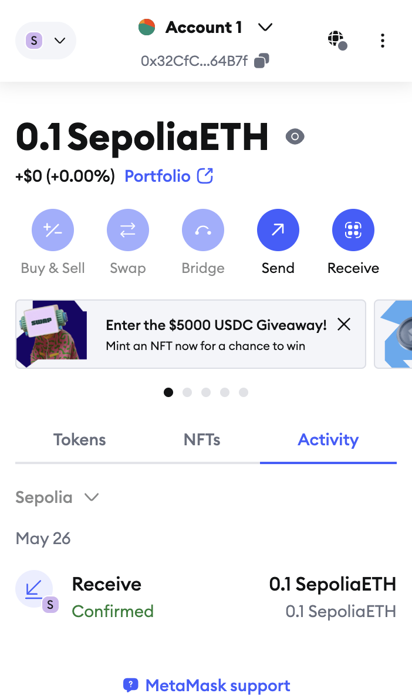
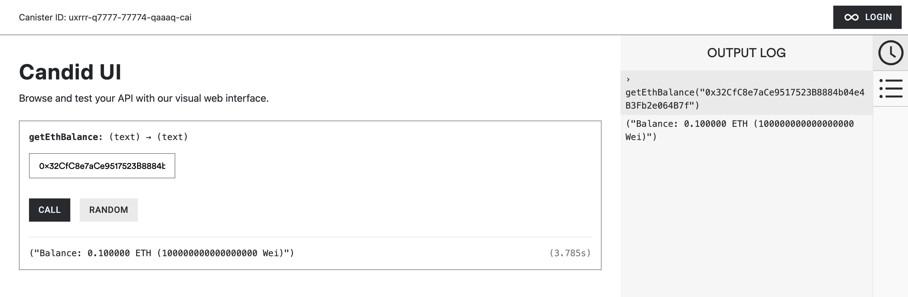

# Ethereum Balance Checker

A simple Motoko canister for checking Ethereum address balances using the EVM RPC canister.

## Overview

This project demonstrates how to query Ethereum address balances from an Internet Computer canister. It uses the EVM RPC canister to communicate with Ethereum's JSON-RPC API without requiring your own API keys or infrastructure.

## Features

- Query ETH balances for any Ethereum address.
- Automatically converts hex-encoded Wei balances to ETH.
- Uses publicly available RPC providers (no API keys required).
- Supports both Ethereum mainnet and Sepolia testnet.

## How it works

1. The canister makes a JSON-RPC call to Ethereum via the EVM RPC canister
2. It receives the balance in hexadecimal Wei format
3. The hexadecimal string is converted to a Motoko Nat
4. The Wei value is converted to ETH (divided by 10^18)
5. The result is formatted and returned

## Available RPC Providers

The EVM RPC canister supports several providers for both mainnet and testnets. For this project, we're using:

- PublicNode: Unauthenticated access, good for testing
- Sepolia: Native testnet provider

## Resources

- [EVM RPC Canister Documentation](https://internetcomputer.org/docs/current/developer-docs/multi-chain/ethereum/evm-rpc/overview)
- [Ethereum JSON-RPC API](https://ethereum.org/en/developers/docs/apis/json-rpc/)
